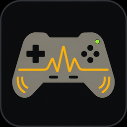
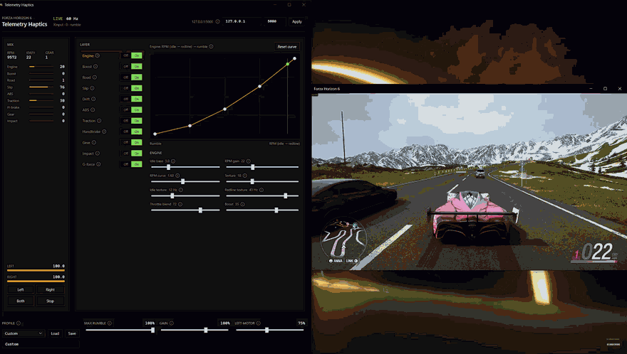

# Forza Horizon 6 Telemetry Haptics



Independent Windows app that turns Forza Horizon 6 **Data Out** UDP into layered **XInput** rumble. Any Xbox-style pad with two grip motors will work — Xbox, 8BitDo in XInput mode, and other third-party XInput controllers.

It is a separate process. It does not modify the game, inject DLLs, read memory, or automate play.

**Not affiliated with Microsoft, Xbox, Playground Games, Forza, or any controller maker.**



## Download (normal use)

You do not need Visual Studio or the .NET SDK. Use the release build:

1. Open [Releases](https://github.com/aravindraju98/Forza-Telemetry-Haptics/releases).
2. Download `ForzaTelemetryHaptics-win-x64.zip` from the latest release.
3. Unzip it anywhere.
4. Run `ForzaTelemetryHaptics.exe`.
5. Turn on Forza Data Out (steps below) and plug in an XInput pad.

Windows may warn on an unsigned exe the first time. That is expected for a small third-party build. Choose **More info → Run anyway** if SmartScreen blocks it.

Only build from source if you want to change the code.

## What it does

While you drive, the pad keeps a low baseline and changes with the car:

- Engine RPM (quieter off-throttle, more texture at redline)
- Turbo boost extra on the right motor
- Road, surface, rumble strips, and puddles, panned per side
- Tire slip and wheelspin
- Drift after a start threshold
- Handbrake grab that scales with speed
- ABS and traction pulses
- Gear-change kicks
- Impacts and suspension thuds
- Optional G-force

Each layer has **Off | On**. Hover **?** for a short tip. Drag the curve like a fan graph. **LEFT MOTOR** ducks the heavier grip motor that most XInput pads use on the left.

A global **MAX RUMBLE** cap keeps the pad from locking at full strength.

## Requirements

- Windows 10 or 11
- Forza Horizon 6 with Data Out on (Horizon titles that send the same 324-byte packet also work)
- Any Windows **XInput** pad with rumble (Xbox, 8BitDo in XInput mode, and similar)
- .NET 8 SDK only if you build from source — not needed for the release zip

## Forza Data Out

1. Start this app first so the UDP port is listening.
2. In Forza: **Settings → HUD and Gameplay**.
3. **Data Out** = On.
4. **Data Out IP Address** = `127.0.0.1` (same PC) or this PC’s LAN IP.
5. **Data Out IP Port** = the app port (default `5000`).
6. Drive. The header should show **LIVE** and a packet rate.

FH6 sends a **324-byte** packet while you are driving. Menus, pause, and replay send nothing; rumble fades out.

Field list: [docs/TELEMETRY.md](docs/TELEMETRY.md).

## Controller

Plug in any pad Windows treats as an Xbox controller. Use **XInput / Windows** mode if the pad has a switch. Maker apps (8BitDo Ultimate Software, and so on) are not required.

Use **Left**, **Right**, **Both**, and **Stop** to confirm rumble before you drive.

These work:

- Xbox wired and wireless
- 8BitDo and other third-party pads in **XInput** mode
- Any Xbox-layout pad with two grip motors that shows up as XInput

These do not, unless Steam Input or a driver presents them as XInput:

- Switch / DInput / Android / PlayStation modes
- DualSense / DualShock
- Pads with no rumble motors

Impulse triggers (Elite and similar) are not driven. This app only uses the two grip motors.

Most XInput pads have a heavier left motor. **LEFT MOTOR** in the footer (default 85%) trims that so a centered mix feels even. Set it to 100% if you want the raw left punch.

## Tune

- **MIX** — live RPM, speed, gear, and per-layer bars.
- **LAYER** — select a layer, switch it off, or edit its curve and sliders.
- **?** — hover for what that control does.
- **Reset curve** — restore that layer’s default graph.
- **PROFILE** — Default, Subtle, Strong, Race, Drift, or your own name.

Gain sliders apply immediately. Bind address and port need **Apply**.

Useful `config.json` keys:

| Key | Role |
| --- | --- |
| `TelemetryBindAddress` / `TelemetryPort` | UDP listener |
| `Haptics.MaximumRumble` | Hard cap |
| `Haptics.GlobalGain` | Master scale |
| `Haptics.LeftMotorScale` | Heavier-motor trim |
| `Haptics.*Enabled` | Per-layer on/off |
| `Haptics.TelemetryTimeoutMs` | Fade after lost packets |

## Build from source

Skip this if you already downloaded the release zip.

```powershell
dotnet restore ForzaTelemetryHaptics.sln
dotnet build ForzaTelemetryHaptics.sln -c Release
dotnet test ForzaTelemetryHaptics.sln -c Release
```

```powershell
dotnet run --project src/ForzaTelemetryHaptics.App -c Release
```

Or `run.bat`. To make your own standalone exe:

```powershell
.\scripts\publish.ps1
```

That writes `publish\ForzaTelemetryHaptics.exe`.

## Troubleshooting

- Packet rate stays 0: Data Out is off, IP/port mismatch, or you are in a menu.
- Parser only accepts **324-byte** Horizon packets.
- Test buttons silent: Windows is not exposing XInput rumble. Check the pad is in XInput mode and that rumble works in another game.
- Two pads: first XInput slot (index 0), or set `ControllerIndex` in `config.json`.

How the mixer is put together: [docs/ARCHITECTURE.md](docs/ARCHITECTURE.md).

## License

MIT. Notices: [docs/THIRD_PARTY_NOTICES.md](docs/THIRD_PARTY_NOTICES.md) and [LICENSE](LICENSE).

No Forza assets or packet captures are included. Use official Data Out only.
